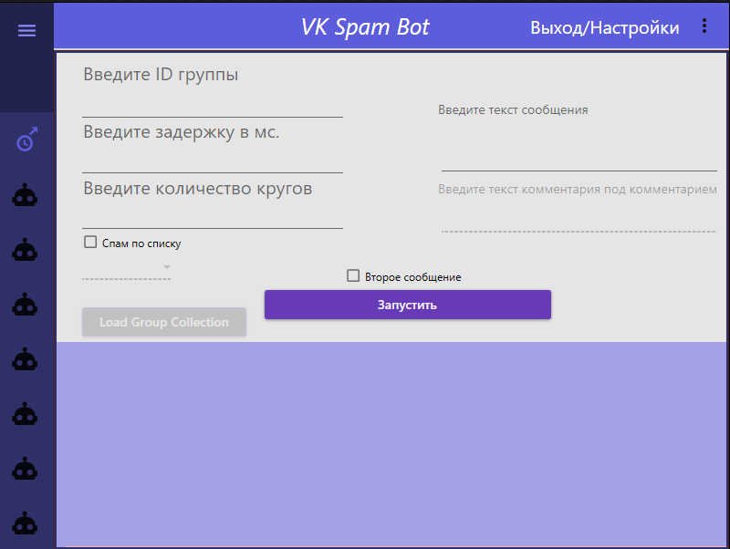

### VkSpamBot
Бот для автоматизации рассылок

Данный бот, был создан по заказу

---

Что представляет из себя данный софт?

Данный софт автоматизирует рассылку в группах вк

Ниже представлен интерфейс программы (WPF)

---

## Функционал

  1. Рассылка по ссылке на группу
  2. Возможность расслки по кругам
  3. Добавление комментария под свой комментарий
  4. Лайк своего комментария для более вероятного обращения внимания других пользователь на данный комментарий
  5. Рассылка по списку

## Как работает данный бот?

Данная программа автоматизирует рассылку. Использован язык C# и фрейворк Vk.Net
По запуску бота, извлекается 5 последних постов из текущей группы в итерации.
Затем, под каждым постом оставляется комментарий с вашим текстом, происходит лайк своего же комментария и при включенной функции второго комментария, оставляется 
ответ к своему комментарию

## Использование

Вы можете запустить скомпилированное приложение по пути - WPFSpamBot\WPFSpamBot\bin\Debug\WPFSpamBot.exe

Или же, при необходимости можете собрать проект сами. Для этого перейдите в \WPFSpamBot и запустите решение WPFSpamBot.sln, далее скомпилирйте приложение

По запуску программы, вам будет необходимо авторизироваться по даннными необходимого аккаунта вк.
После авторизации, будет интерфейс, в котором нужно укзать группу вк, в которой будет происходить рассылка или же, загрузить список групп вк.
Список должен иметь расширение .txt, группы вставлять с каждой новой строки
Далее пишете нужный текст для комментария и при необходимости включаете второй комментарий
Затем, можете запускать бота
---
Готово
